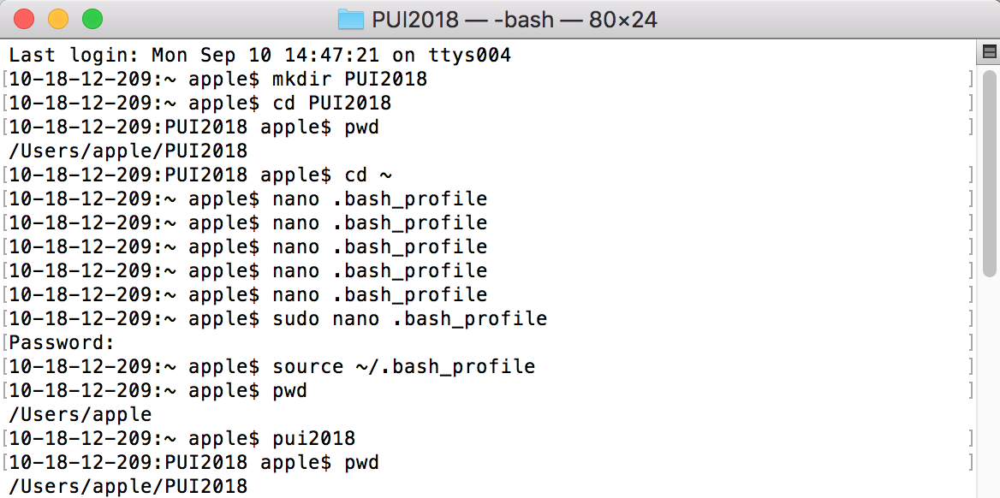
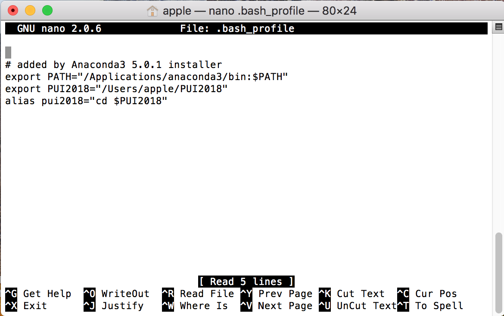

# PUI2018_jl9760
I created a directory on my computer called PUI2018 using *mkdir*
Then I used *cd* command to to get back into the folder I just created.
Then I used *pwd* command.

Then I used nano .bash_profile to save an enviroment variable permanently.

