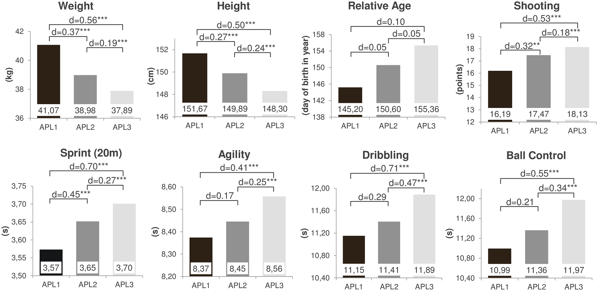

## Assignment 1: I reviewed my classmate's CitiBike project proposal and worte some comments and suggestions.
## Assignment 2:
| **Statistical Analyses**	|  **IV(s)**  |  **IV type(s)** |  **DV(s)**  |  **DV type(s)**  |  **Control Var** | **Control Var type**  | **Question to be answered** | **_H0_** | **alpha** | **link to paper**| 
|:----------:|:----------|:------------|:-------------|:-------------|:------------|:------------- |:------------------|:----:|:-------:|:-------|
ANOVA	| 8, Height; Weight; Relative Age; Sprint; Agility; Dribbling; Ball Control; Shooting | Categorical | 1, Adult Performance Level(APL)| categorical | 1, age | continuous (could also be categorical) | 	Do the motor and anthropometric variables show a prognostic relevance for future success in adulthood? | Players who reached higher APL do not have better motor test result than players with lower APL. | 0.05 | [The influence of speed abilities and technical skills in early adolescence on adult success in soccer: A long-term prospective analysis using ANOVA and SEM approaches](https://journals.plos.org/plosone/article?id=10.1371/journal.pone.0182211) |
  |||||||||

