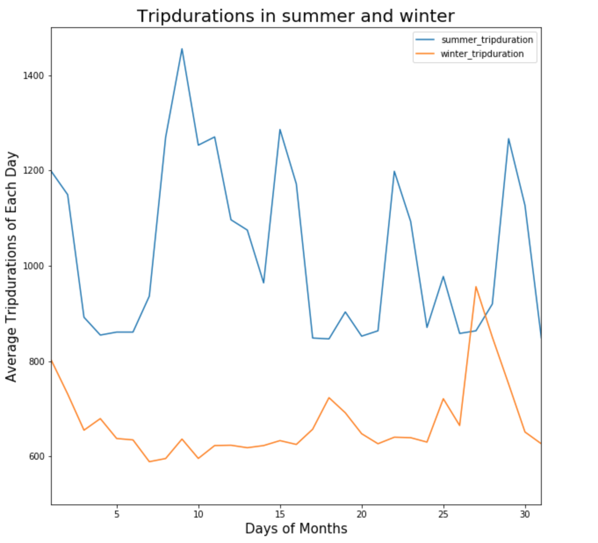

# Assignment1

This graph shows the trip duration of Citibike users in summer and winter.
# Assigment2
https://www.authorea.com/336148/Jc7Xl_yHLko0--PpS6IPOQ

CLARITY 
The seasonal plot of Trip duration in summer and winter is very coherent and accessible to follow the outcome of the data through the layout of the plot. The caption of the plot is very direct and straightforward. One minor issue the of orange color was used for the winter trip duration, is not at visible as the blue. Overall the plot was excellent and clear.
Aesthtic
The color used for the plot was an excellent choice to identify the trip duration during the winter and summer. However, the use of orange color was a bit difficult to see compared to the use of blue. Overall, the plot is sold and understandable.  
Honesty 
Overall the plot is visualization is straightforward the presents the data honestly throughout the using the process of analyzing the data.
